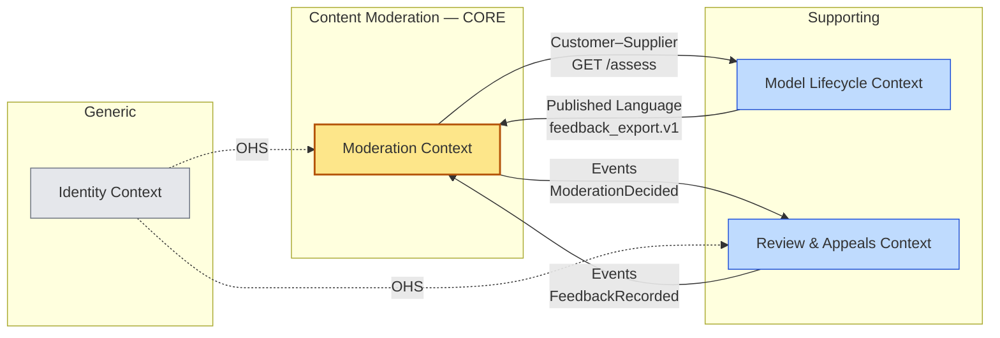
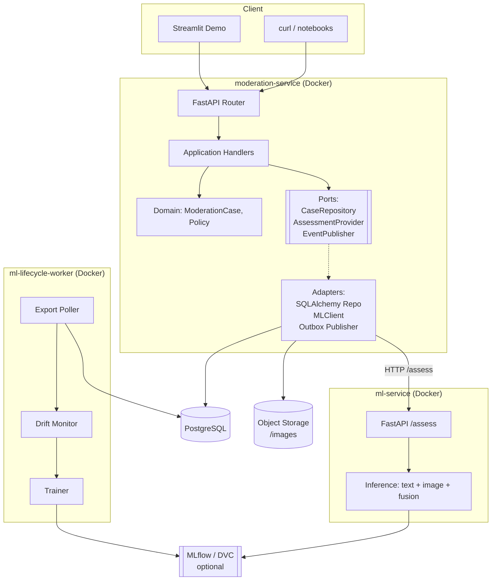
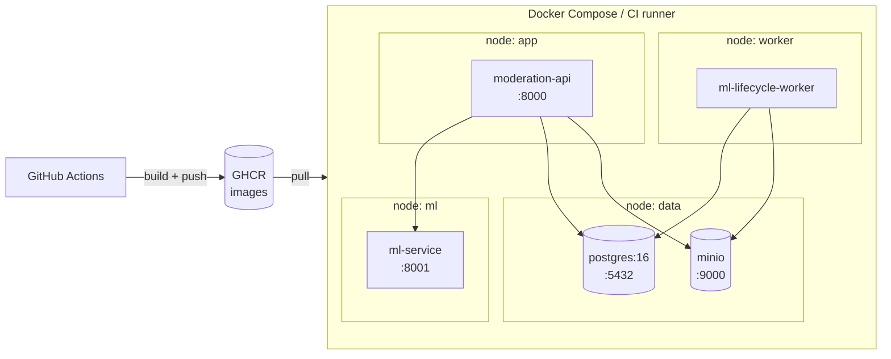

## Context map

```mermaid
flowchart LR
    subgraph Core["Content Moderation — CORE"]
        CM[Moderation Context]
    end

    subgraph Supporting["Supporting"]
        ML[Model Lifecycle Context]
        RV[Review & Appeals Context]
    end

    subgraph Generic["Generic"]
        ID[Identity Context]
    end

    CM -->|"Customer–Supplier<br/>GET /assess"| ML
    ML -->|"Published Language<br/>feedback_export.v1"| CM
    CM -->|"Events<br/>ModerationDecided"| RV
    RV -->|"Events<br/>FeedbackRecorded"| CM
    ID -.->|"OHS"| CM
    ID -.->|"OHS"| RV

    classDef core fill:#fde68a,stroke:#b45309,stroke-width:2px
    classDef sup fill:#bfdbfe,stroke:#1d4ed8
    classDef gen fill:#e5e7eb,stroke:#6b7280
    class CM core
    class ML,RV sup
    class ID gen
```
## UML Component Diagram

```mermaid
flowchart TB
    subgraph Client
        WEB[Streamlit Demo]
        CUR[curl / notebooks]
    end

    subgraph App["moderation-service (Docker)"]
        API[FastAPI Router]
        APP[Application Handlers]
        DOM[Domain: ModerationCase, Policy]
        PORTS[[Ports:\nCaseRepository\nAssessmentProvider\nEventPublisher]]
        ADP[Adapters:\nSQLAlchemy Repo\nMLClient\nOutbox Publisher]
        API --> APP --> DOM
        APP --> PORTS
        PORTS -.-> ADP
    end

    subgraph ML["ml-service (Docker)"]
        MLS[FastAPI /assess]
        INF[Inference: text + image + fusion]
        MLS --> INF
    end

    subgraph Worker["ml-lifecycle-worker (Docker)"]
        JOB[Export Poller]
        DRIFT[Drift Monitor]
        TRAIN[Trainer]
        JOB --> DRIFT --> TRAIN
    end

    DB[(PostgreSQL)]
    S3[(Object Storage\n/images)]
    MLF[[MLflow / DVC\noptional]]

    WEB --> API
    CUR --> API
    ADP --> DB
    ADP --> S3
    ADP -->|HTTP /assess| MLS
    JOB --> DB
    TRAIN --> MLF
    INF --> MLF
```
## UML Deployment Diagram

``` mermaid
flowchart LR
    subgraph Host["Docker Compose / CI runner"]
        subgraph N1["node: app"]
            C1["moderation-api\n:8000"]
        end
        subgraph N2["node: ml"]
            C2["ml-service\n:8001"]
        end
        subgraph N3["node: worker"]
            C3["ml-lifecycle-worker"]
        end
        subgraph N4["node: data"]
            C4[("postgres:16\n:5432")]
            C5[("minio\n:9000")]
        end
        C1 --> C2
        C1 --> C4
        C1 --> C5
        C3 --> C4
        C3 --> C5
    end

    GH["GitHub Actions"]
    GH -->|build + push| REG[("GHCR\nimages")]
    REG -->|pull| Host
```
