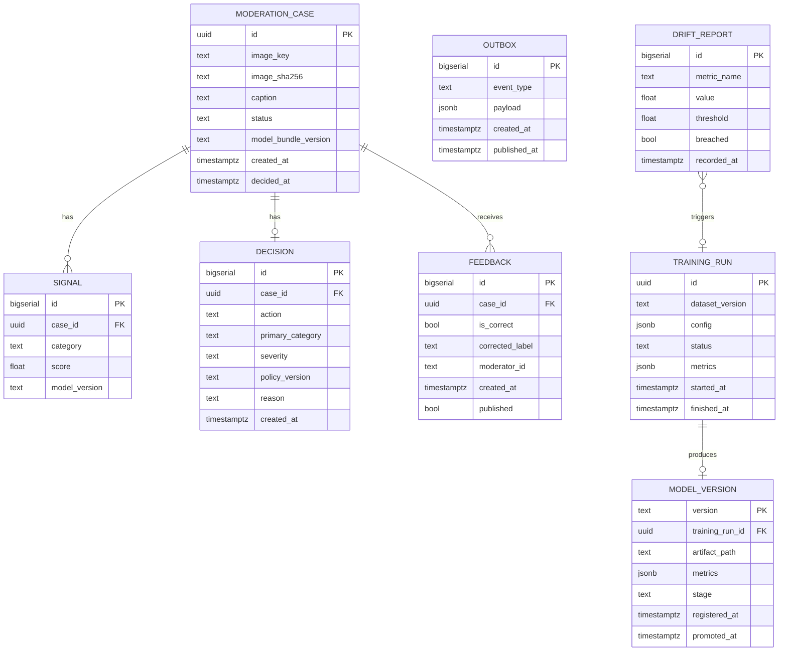

## ER Diagram — Postgres

```mermaid
erDiagram
    %% schema: moderation
    MODERATION_CASE {
        uuid id PK
        text image_key
        text image_sha256
        text caption
        text status
        text model_bundle_version
        timestamptz created_at
        timestamptz decided_at
    }
    SIGNAL {
        bigserial id PK
        uuid case_id FK
        text category
        float score
        text model_version
    }
    DECISION {
        bigserial id PK
        uuid case_id FK
        text action
        text primary_category
        text severity
        text policy_version
        text reason
        timestamptz created_at
    }
    FEEDBACK {
        bigserial id PK
        uuid case_id FK
        bool is_correct
        text corrected_label
        text moderator_id
        timestamptz created_at
        bool published
    }
    OUTBOX {
        bigserial id PK
        text event_type
        jsonb payload
        timestamptz created_at
        timestamptz published_at
    }

    MODERATION_CASE ||--o{ SIGNAL : has
    MODERATION_CASE ||--o| DECISION : has
    MODERATION_CASE ||--o{ FEEDBACK : receives

    %% schema: ml_lifecycle
    TRAINING_RUN {
        uuid id PK
        text dataset_version
        jsonb config
        text status
        jsonb metrics
        timestamptz started_at
        timestamptz finished_at
    }
    MODEL_VERSION {
        text version PK
        uuid training_run_id FK
        text artifact_path
        jsonb metrics
        text stage
        timestamptz registered_at
        timestamptz promoted_at
    }
    DRIFT_REPORT {
        bigserial id PK
        text metric_name
        float value
        float threshold
        bool breached
        timestamptz recorded_at
    }

    TRAINING_RUN ||--o| MODEL_VERSION : produces
    DRIFT_REPORT }o--o| TRAINING_RUN : triggers
```
