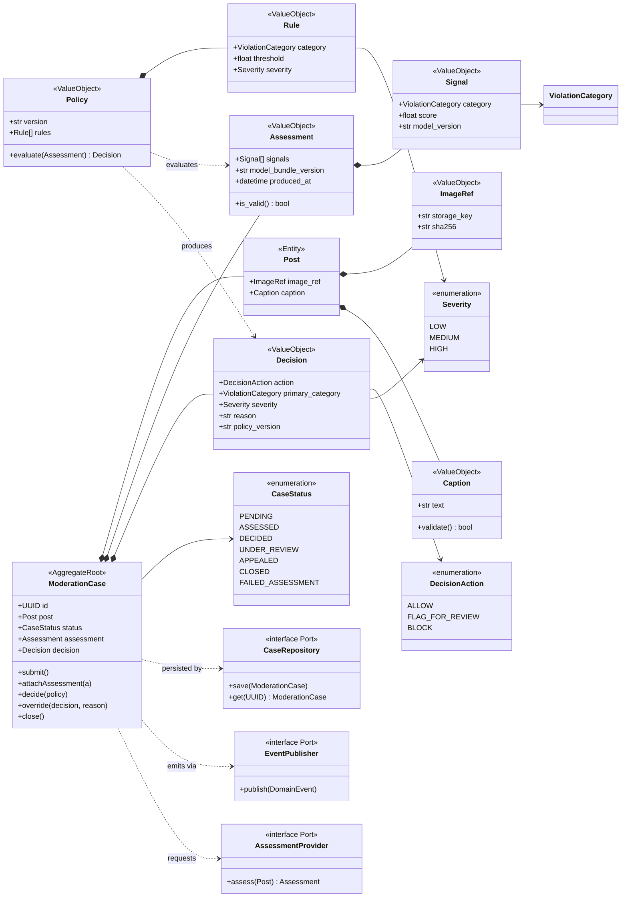
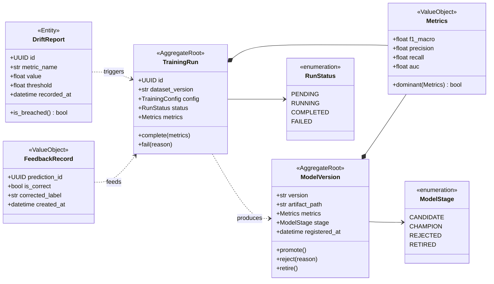
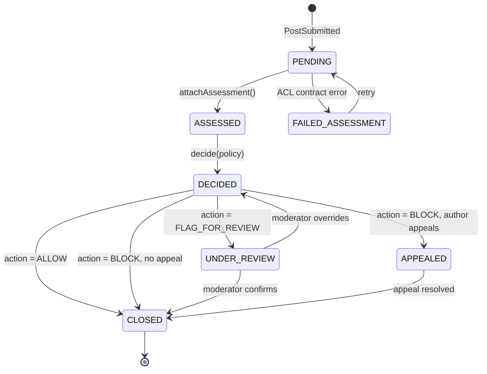

## UML Class — Moderation Domain

```mermaid
classDiagram
    direction LR

    class ModerationCase {
        <<AggregateRoot>>
        +UUID id
        +Post post
        +CaseStatus status
        +Assessment assessment
        +Decision decision
        +submit()
        +attachAssessment(a)
        +decide(policy)
        +override(decision, reason)
        +close()
    }

    class Post {
        <<Entity>>
        +ImageRef image_ref
        +Caption caption
    }

    class ImageRef {
        <<ValueObject>>
        +str storage_key
        +str sha256
    }

    class Caption {
        <<ValueObject>>
        +str text
        +validate() bool
    }

    class Assessment {
        <<ValueObject>>
        +Signal[] signals
        +str model_bundle_version
        +datetime produced_at
        +is_valid() bool
    }

    class Signal {
        <<ValueObject>>
        +ViolationCategory category
        +float score
        +str model_version
    }

    class Policy {
        <<ValueObject>>
        +str version
        +Rule[] rules
        +evaluate(Assessment) Decision
    }

    class Rule {
        <<ValueObject>>
        +ViolationCategory category
        +float threshold
        +Severity severity
    }

    class Decision {
        <<ValueObject>>
        +DecisionAction action
        +ViolationCategory primary_category
        +Severity severity
        +str reason
        +str policy_version
    }

    class CaseStatus {
        <<enumeration>>
        PENDING
        ASSESSED
        DECIDED
        UNDER_REVIEW
        APPEALED
        CLOSED
        FAILED_ASSESSMENT
    }

    class DecisionAction {
        <<enumeration>>
        ALLOW
        FLAG_FOR_REVIEW
        BLOCK
    }

    class Severity {
        <<enumeration>>
        LOW
        MEDIUM
        HIGH
    }

    class AssessmentProvider {
        <<interface Port>>
        +assess(Post) Assessment
    }

    class CaseRepository {
        <<interface Port>>
        +save(ModerationCase)
        +get(UUID) ModerationCase
    }

    class EventPublisher {
        <<interface Port>>
        +publish(DomainEvent)
    }

    ModerationCase *-- Post
    ModerationCase *-- Assessment
    ModerationCase *-- Decision
    ModerationCase --> CaseStatus
    Post *-- ImageRef
    Post *-- Caption
    Assessment *-- Signal
    Signal --> ViolationCategory
    Policy *-- Rule
    Policy ..> Assessment : evaluates
    Policy ..> Decision : produces
    Decision --> DecisionAction
    Decision --> Severity
    Rule --> Severity

    ModerationCase ..> CaseRepository : persisted by
    ModerationCase ..> EventPublisher : emits via
    ModerationCase ..> AssessmentProvider : requests
```

## UML Class — ML Lifecycle Domain

```mermaid
classDiagram
    direction LR

    class ModelVersion {
        <<AggregateRoot>>
        +str version
        +str artifact_path
        +Metrics metrics
        +ModelStage stage
        +datetime registered_at
        +promote()
        +reject(reason)
        +retire()
    }

    class TrainingRun {
        <<AggregateRoot>>
        +UUID id
        +str dataset_version
        +TrainingConfig config
        +RunStatus status
        +Metrics metrics
        +complete(metrics)
        +fail(reason)
    }

    class DriftReport {
        <<Entity>>
        +UUID id
        +str metric_name
        +float value
        +float threshold
        +datetime recorded_at
        +is_breached() bool
    }

    class Metrics {
        <<ValueObject>>
        +float f1_macro
        +float precision
        +float recall
        +float auc
        +dominant(Metrics) bool
    }

    class ModelStage {
        <<enumeration>>
        CANDIDATE
        CHAMPION
        REJECTED
        RETIRED
    }

    class RunStatus {
        <<enumeration>>
        PENDING
        RUNNING
        COMPLETED
        FAILED
    }

    class FeedbackRecord {
        <<ValueObject>>
        +UUID prediction_id
        +bool is_correct
        +str corrected_label
        +datetime created_at
    }

    ModelVersion *-- Metrics
    ModelVersion --> ModelStage
    TrainingRun *-- Metrics
    TrainingRun --> RunStatus
    TrainingRun ..> ModelVersion : produces
    DriftReport ..> TrainingRun : triggers
    FeedbackRecord ..> TrainingRun : feeds
```

## UML State Machine — ModerationCase

```mermaid
stateDiagram-v2
    [*] --> PENDING : PostSubmitted

    PENDING --> ASSESSED : attachAssessment()
    PENDING --> FAILED_ASSESSMENT : ACL contract error
    FAILED_ASSESSMENT --> PENDING : retry

    ASSESSED --> DECIDED : decide(policy)

    DECIDED --> CLOSED : action = ALLOW
    DECIDED --> UNDER_REVIEW : action = FLAG_FOR_REVIEW
    DECIDED --> APPEALED : action = BLOCK, author appeals
    DECIDED --> CLOSED : action = BLOCK, no appeal

    UNDER_REVIEW --> CLOSED : moderator confirms
    UNDER_REVIEW --> DECIDED : moderator overrides

    APPEALED --> CLOSED : appeal resolved

    CLOSED --> [*]
```
