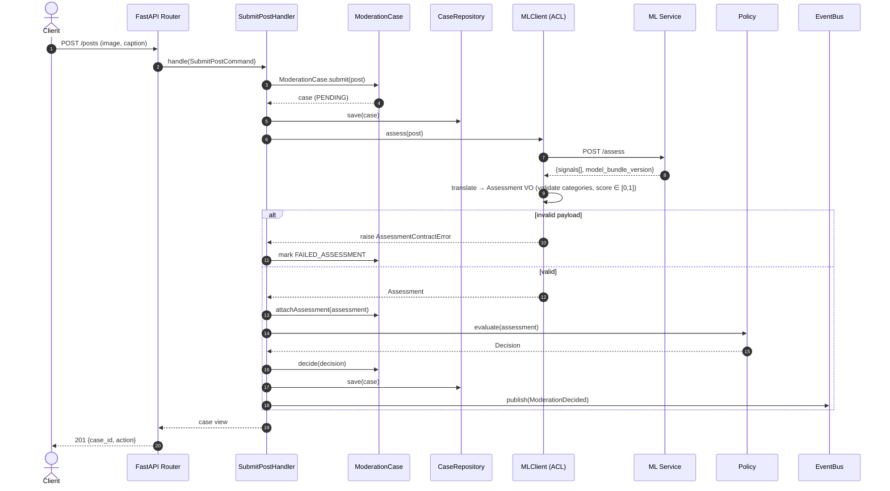
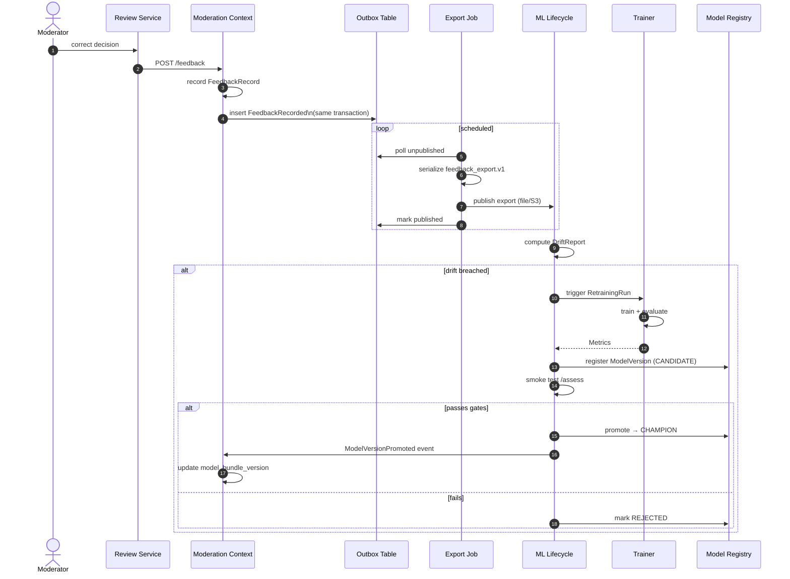

## UML Sequence — Submit & Assess

```mermaid
sequenceDiagram
    autonumber
    actor U as Client
    participant API as FastAPI Router
    participant UC as SubmitPostHandler
    participant DOM as ModerationCase
    participant REPO as CaseRepository
    participant ACL as MLClient (ACL)
    participant ML as ML Service
    participant POL as Policy
    participant BUS as EventBus

    U->>API: POST /posts (image, caption)
    API->>UC: handle(SubmitPostCommand)
    UC->>DOM: ModerationCase.submit(post)
    DOM-->>UC: case (PENDING)
    UC->>REPO: save(case)

    UC->>ACL: assess(post)
    ACL->>ML: POST /assess
    ML-->>ACL: {signals[], model_bundle_version}
    ACL->>ACL: translate → Assessment VO (validate categories, score ∈ [0,1])
    alt invalid payload
        ACL-->>UC: raise AssessmentContractError
        UC->>DOM: mark FAILED_ASSESSMENT
    else valid
        ACL-->>UC: Assessment
        UC->>DOM: attachAssessment(assessment)
        UC->>POL: evaluate(assessment)
        POL-->>UC: Decision
        UC->>DOM: decide(decision)
        UC->>REPO: save(case)
        UC->>BUS: publish(ModerationDecided)
    end
    UC-->>API: case view
    API-->>U: 201 {case_id, action}
```

## UML Sequence — Feedback → Retraining → Promotion

```mermaid
sequenceDiagram
    autonumber
    actor M as Moderator
    participant RV as Review Service
    participant MOD as Moderation Context
    participant OUT as Outbox Table
    participant EXP as Export Job
    participant ML as ML Lifecycle
    participant TR as Trainer
    participant REG as Model Registry

    M->>RV: correct decision
    RV->>MOD: POST /feedback
    MOD->>MOD: record FeedbackRecord
    MOD->>OUT: insert FeedbackRecorded\n(same transaction)

    loop scheduled
        EXP->>OUT: poll unpublished
        EXP->>EXP: serialize feedback_export.v1
        EXP->>ML: publish export (file/S3)
        EXP->>OUT: mark published
    end

    ML->>ML: compute DriftReport
    alt drift breached
        ML->>TR: trigger RetrainingRun
        TR->>TR: train + evaluate
        TR-->>ML: Metrics
        ML->>REG: register ModelVersion (CANDIDATE)
        ML->>ML: smoke test /assess
        alt passes gates
            ML->>REG: promote → CHAMPION
            ML->>MOD: ModelVersionPromoted event
            MOD->>MOD: update model_bundle_version
        else fails
            ML->>REG: mark REJECTED
        end
    end
```
